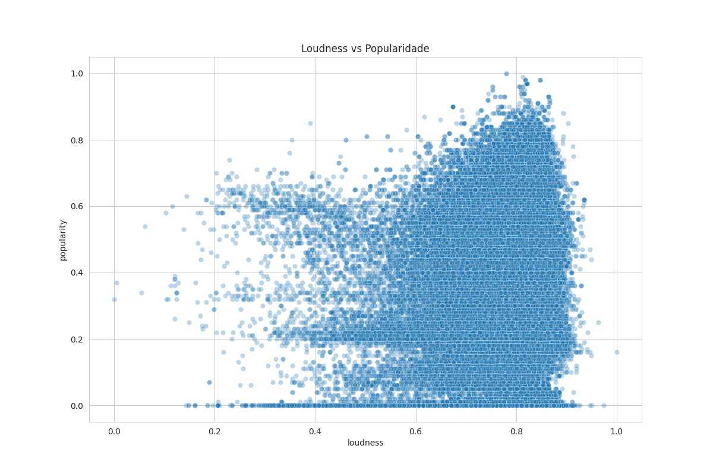
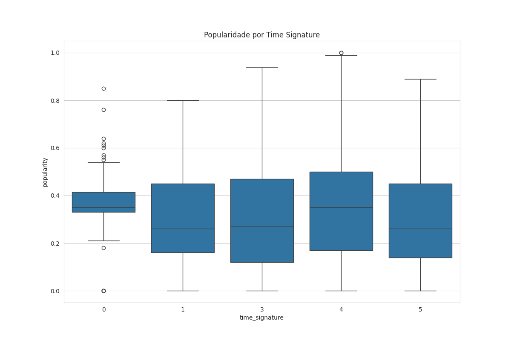
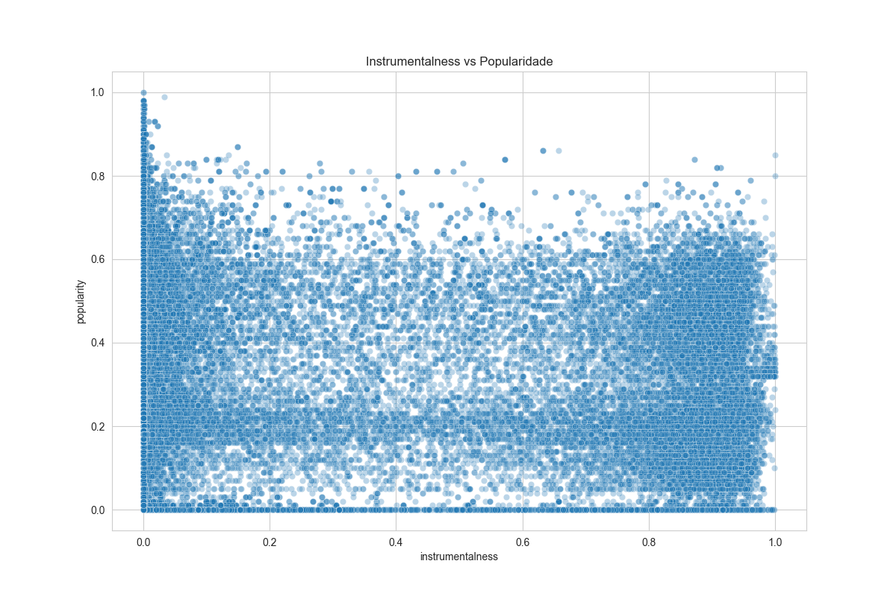
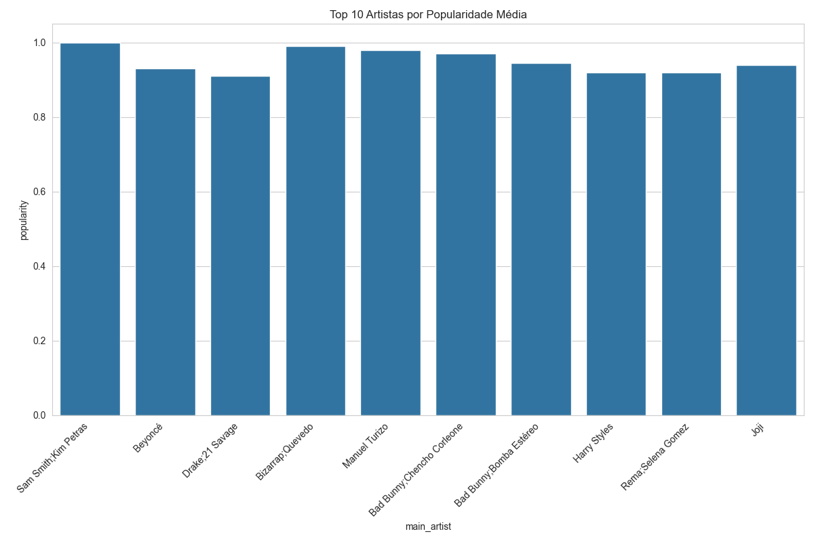
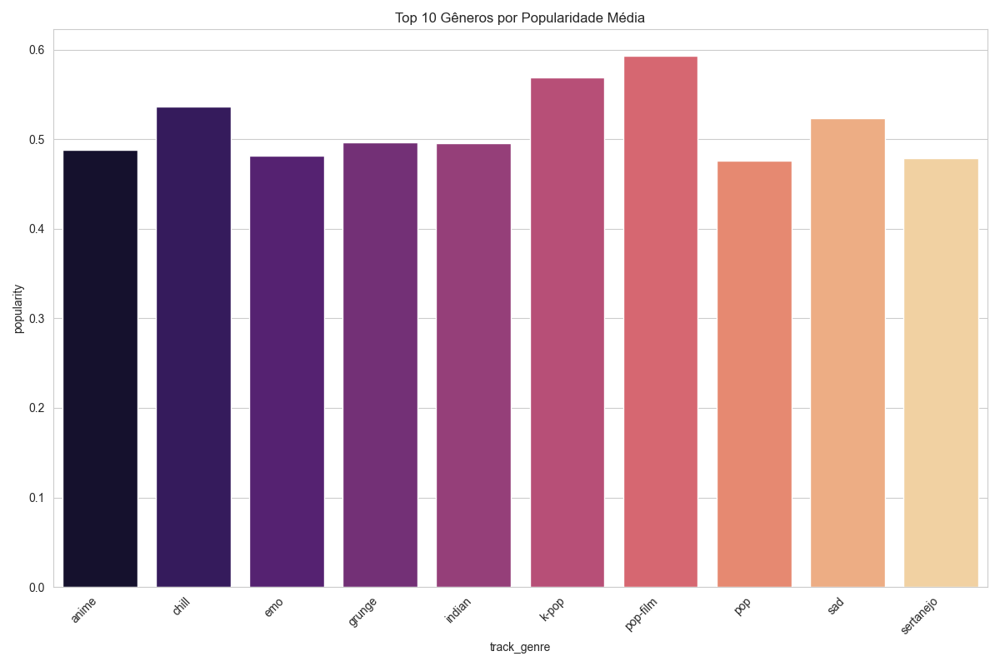

# 🎵 Previsão da Popularidade de Músicas com Base em Suas Características

## 📘 Descrição do Projeto

Este projeto foi desenvolvido para a disciplina **Análise de Dados** e tem como objetivo prever a **popularidade de músicas** a partir de suas características sonoras, como energia, valência, danceabilidade, duração e intensidade.

O trabalho propõe a aplicação de um *pipeline* completo de **ETL (Extração, Transformação e Carga)**, **Análise Exploratória de Dados (EDA)**, **Modelagem Preditiva** e **Interpretação de Resultados**, utilizando o conjunto de dados **Spotify Tracks Dataset**, disponível publicamente no Kaggle.

Além do código e das análises, foi elaborado um **arquivo PDF explicativo** com detalhes sobre os gráficos e as interpretações, com o intuito de complementar a clareza da análise e facilitar a compreensão dos resultados.

---

## 🎯 Objetivos

### **Objetivo Geral**
Prever a **popularidade de músicas** com base em variáveis extraídas de faixas musicais, aplicando métodos de análise de dados e aprendizado de máquina.

### **Objetivos Específicos**
*   Compreender a estrutura e as variáveis do conjunto de dados do Spotify.
*   Executar o processo de **ETL (extração, transformação e limpeza)** dos dados.
*   Realizar **análises exploratórias** e **visualizações gráficas** relevantes.
*   Aplicar e comparar diferentes **modelos preditivos** para estimar a popularidade.
*   Avaliar os resultados e identificar os fatores que mais influenciam o sucesso musical.

---

## 🧠 Justificativa

Com o crescimento das plataformas de *streaming* e o volume crescente de dados musicais disponíveis, compreender os fatores que influenciam a popularidade de uma música tornou-se fundamental para artistas, gravadoras e serviços de recomendação. O projeto busca unir a análise técnica com um contexto cultural e criativo, promovendo uma visão mais ampla do papel dos dados no entretenimento.

---

## 🧩 Estrutura do Projeto

A estrutura do projeto é organizada da seguinte forma:

```
popularidadeDeMusicas/
├── arquivoOriginal/               # Arquivos originais do dataset (dataset.csv)
├── results/                       # Gráficos, tabelas e resultados finais (model_results.json, *.png)
├── etl_spotify.py                 # Script para o processo de ETL
├── eda.py                         # Script para a Análise Exploratória de Dados
├── modelagem.py                   # Script para os Modelos de Machine Learning
├── main.py                        # Script de execução geral do pipeline
├── README.md                      # Documentação principal
├── requirements.txt               # Dependências do projeto
└── spotify_tracks_transformed.csv # Dataset após o ETL (gerado após a primeira execução)
```

---

## 🚀 Como Executar o Projeto

Para reproduzir a análise e os resultados, siga os passos abaixo:

### 1. Pré-requisitos

Certifique-se de ter o **Python 3** instalado em seu ambiente.

### 2. Instalação das Dependências

Instale todas as bibliotecas necessárias listadas no arquivo `requirements.txt`:

```bash
pip install -r requirements.txt
```

### 3. Preparação dos Dados

1.  Baixe o conjunto de dados **Spotify Tracks Dataset** (o arquivo `dataset.csv`) na fonte original do Kaggle.
2.  Coloque o arquivo `dataset.csv` dentro da pasta `arquivoOriginal/`.

### 4. Execução do Pipeline

O script `main.py` executa o *pipeline* completo (ETL, EDA e Modelagem) em sequência.

```bash
python3 main.py
```

Após a execução, todos os gráficos, estatísticas e resultados dos modelos serão salvos automaticamente na pasta `results/`.

---

## 💾 Base de Dados

**Fonte:** [Kaggle – Ultimate Spotify Tracks DB]
**Descrição:** Contém mais de **230 mil faixas** do Spotify, com informações sobre:
*   Nome do artista e da faixa
*   Gênero musical
*   Popularidade (variável-alvo)
*   Atributos de áudio: `danceability`, `energy`, `valence`, `tempo`, `loudness`, `speechiness`, `duration_ms`, entre outros.

**Tipo de Problema:** Regressão (prever o valor numérico da popularidade).

---

## 🧰 Tecnologias Utilizadas

O projeto foi desenvolvido utilizando as seguintes tecnologias e bibliotecas:

*   **Linguagem:** Python 3.x
*   **Manipulação de Dados:** Pandas, NumPy
*   **Visualização:** Matplotlib, Seaborn
*   **Machine Learning:** Scikit-Learn, XGBoost
*   **Modelos:** Regressão Linear, Random Forest Regressor, XGBoost Regressor

---

## 📊 Análise Visual (EDA)

Esta seção apresenta os principais gráficos gerados pela Análise Exploratória de Dados (`eda.py`), que ajudam a visualizar a distribuição dos dados e as relações entre as variáveis.

### Distribuição da Variável Alvo (Popularidade)


### Matriz de Correlação

A matriz de correlação mostra a relação linear entre as variáveis numéricas, destacando quais atributos de áudio têm maior impacto na popularidade.


### Relação entre Atributos e Popularidade

Os gráficos de dispersão e boxplots ajudam a entender a influência de atributos específicos, como `loudness` e `instrumentalness`, na popularidade das músicas.





### Top Artistas e Gêneros




---

## 📈 Resultados da Modelagem

O objetivo de R² ≥ 0.70 é ambicioso para este tipo de problema. O modelo **Random Forest Regressor** apresentou o melhor desempenho, com resultados que demonstram a capacidade preditiva do modelo, embora não atinja o *benchmark* inicial.

| Modelo | R² (Coeficiente de Determinação) | RMSE (Raiz do Erro Quadrático Médio) |
| :--- | :--- | :--- |
| Regressão Linear | 0.0234 | 0.2195 |
| **Random Forest Regressor** | **0.5236** | **0.1533** |
| XGBoost Regressor | 0.3215 | 0.1830 |

### Fatores de Maior Influência

As variáveis que mais contribuíram para a previsão de popularidade no modelo Random Forest foram:

1.  `genre_encoded` (Gênero Musical)
2.  `acousticness` (Acusticidade)
3.  `duration_s` (Duração da Música em Segundos)
4.  `danceability` (Dançabilidade)
5.  `valence` (Valência/Positividade)

---

## 📘 Documentação Complementar

Além do repositório, foi elaborado um PDF explicativo, contendo:

*   Introdução
*   Metodologia detalhada
*   Gráficos e análises
*   Avaliação dos modelos
*   Conclusão

📎 O arquivo PDF final deve ser anexado aqui.

---

## 📚 Referências

*   Zaheen Hamidani. *Ultimate Spotify Tracks Dataset.* Kaggle, 2022.
*   Spotify for Developers – [Audio Features Documentation](https://developer.spotify.com/documentation/web-api/reference/get-several-audio-features).

---

## 💡 Autores:

*   Ana Flávia Alves Rosa
*   Beatriz da Costa Lauro
*   Brenda Bonaita de Oliveira
*   José Rodrigues de França
*   Letícia Gomes dos Santos

### 6° Período — Universidade do Estado de Minas Gerais (UEMG)
